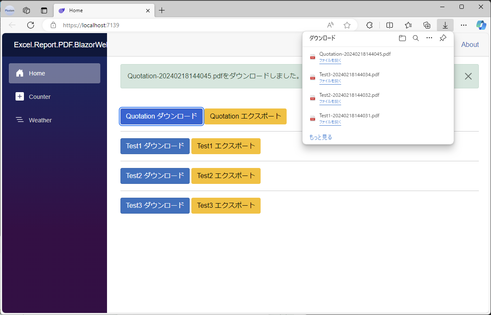
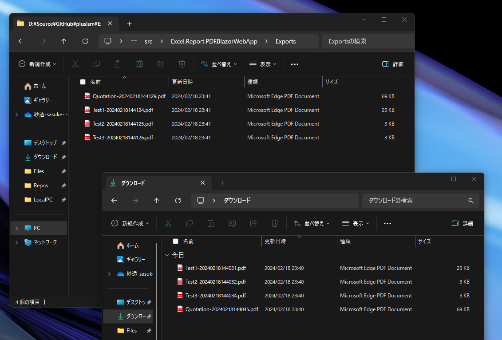

# Excel.Report.PDF.BlazorWebApp

NuGetパッケージ「[Excel.Report.PDF](https://www.nuget.org/packages/Excel.Report.PDF)」をBlazorWebApp(.NET8)で実装してみたサンプルで、InteractiveServerモードで簡単にExcelからPDFの生成とダウンロードが可能。

サンプルの内容は「Excel.Report.PDF」リポジトリのテストプロジェクトの実装をもとに、Blazor(ASP.NET Core)用に微調整しただけとなります。
(IFontResolverの実装部分を多少ゴニョニョ…。

PDF生成処理をServiceに分離すればInteractiveAutoなどでも応用できそう？

「Excel.Report.PDF」については、[Codeer-Softwareさんのリポジトリ](https://github.com/Codeer-Software/Excel.Report.PDF)をご覧ください。

